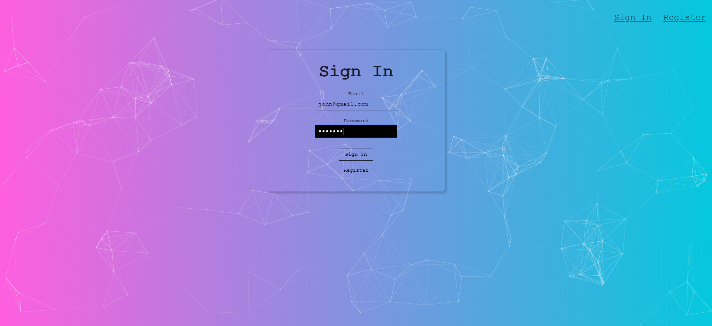
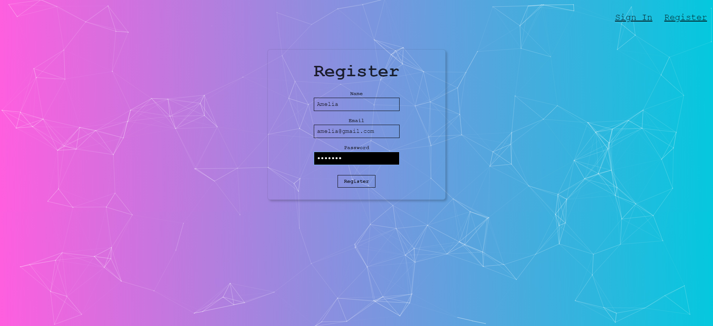
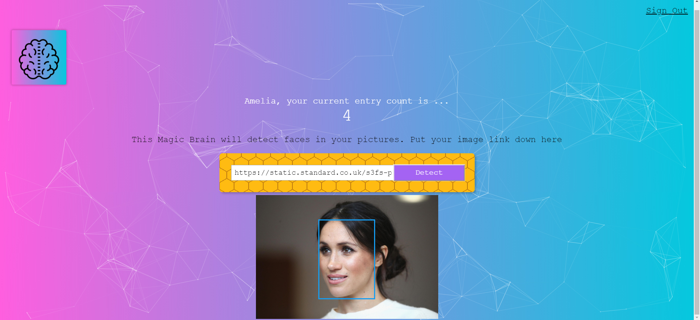

#Face Recognition API Back-End
You must add your own API key in the controllers/image.js file to connect to Clarifai API.

A full stack Face Recognition application created with a sub machine learning API and [React.js](https://github.com/facebook/react) library and the [Create-React-App](https://github.com/facebook/create-react-app) package for the front-end side, Node JS, Express for the back-end side, Postman for testing and PostgreSQL for the database. 

Try [Face Recognition](https://smart-facedetector.herokuapp.com/)  
Face recognition from pictures. Click Register and or Sign in to go to Homepage of Smart Brain. Put your image link and press detect, it will recognize the face from the image. Click Sign out to go back to the sign in page.

#### Notes on implementation
Add your own API key in the controllers/image.js file to connect to Clarifai API.
Make sure you have Node.js and npm installed. 
Clone this repo.
Run npm install.
Run npm start.

** Make sure you use postgreSQL instead of mySQL for this code base.# Face-Recognition-API

  
  
  

for working app Try [Face Recognition](https://smart-facedetector.herokuapp.com/)